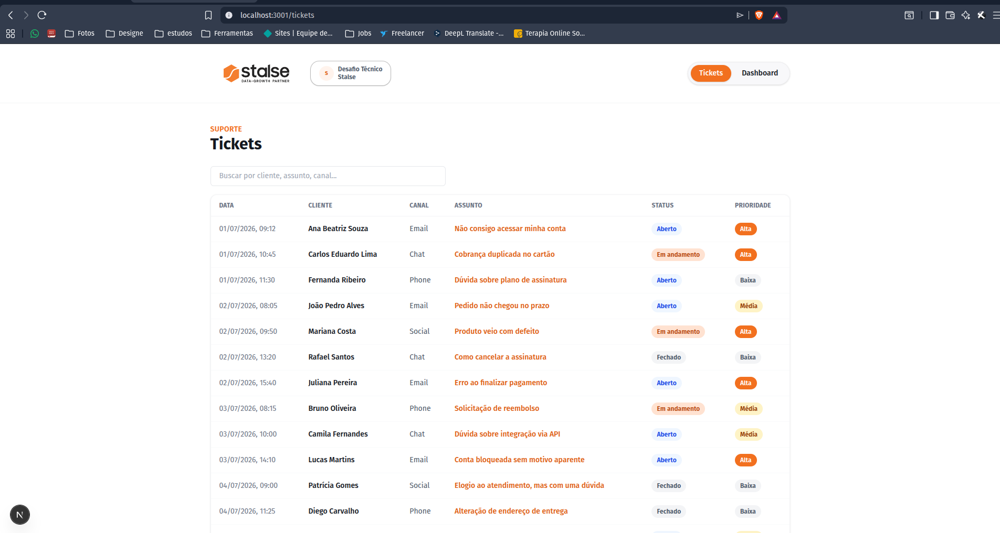
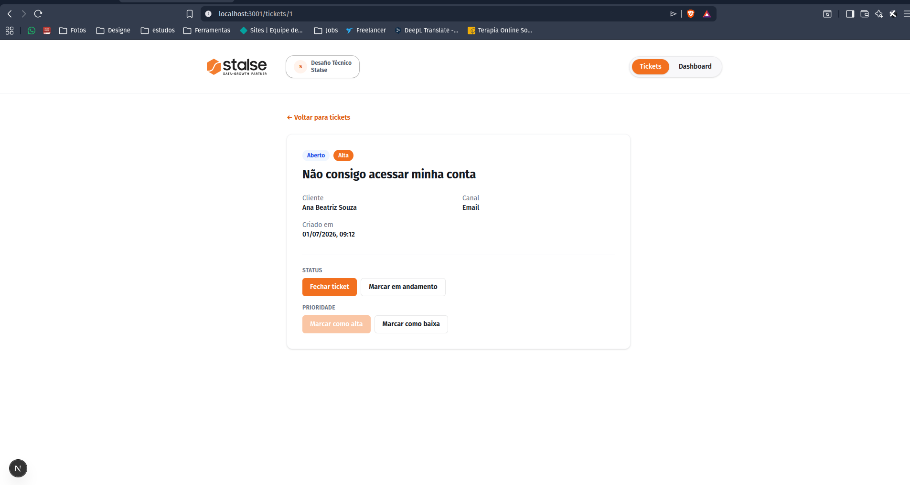
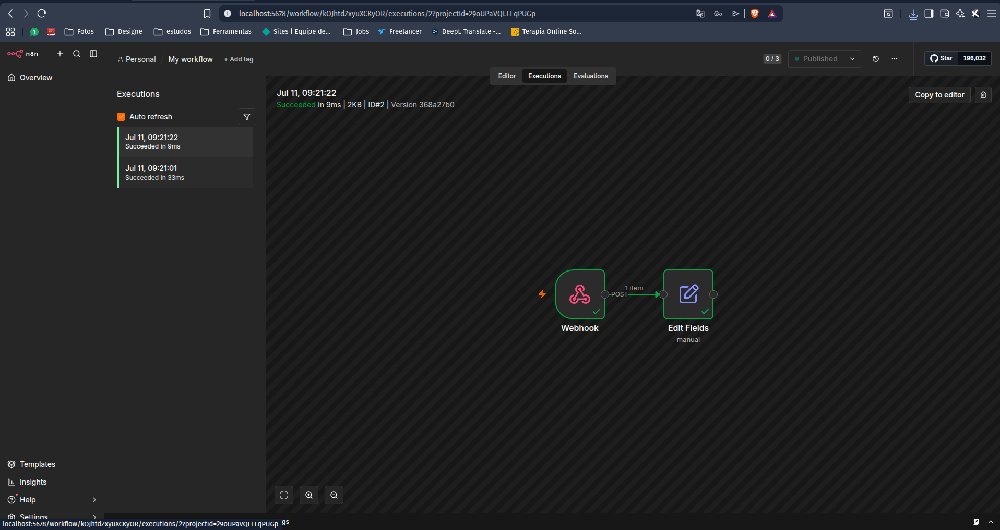

# Mini Inbox — Desafio Técnico Stalse

Mini sistema de inbox de tickets de suporte: listagem e edição de tickets,
dashboard com métricas geradas via ETL (pandas) a partir de um dataset do
Kaggle, e automação via n8n disparada por webhook quando um ticket é fechado
ou marcado como prioridade alta.

## Deploy (demo ao vivo)

> O desafio não exige deploy (rodar localmente já é suficiente), mas o
> projeto também está publicado:

- **Frontend**: https://desafio-stalse-mini-inbox.netlify.app
- **Backend**: https://desafio-stalse.onrender.com (`/docs` para o Swagger)
- **n8n**: não hospedado (ver "Sobre o n8n na demo ao vivo" abaixo)

O backend está no free tier do Render — a primeira requisição após um
período de inatividade pode levar alguns segundos (cold start).

### Sobre o n8n na demo ao vivo

A demo publicada roda sem `N8N_WEBHOOK_URL` configurada, então o disparo do
webhook fica inerte (o backend simplesmente não tenta chamar nada — ver
`backend/app/webhook.py`, comportamento coberto por teste). Isso foi uma
decisão consciente, não uma limitação do código:

- Tentei hospedar o n8n numa VM `e2-micro` (Always Free) do **GCP**: além de
  um bug no agente de deploy de container da GCP com o registry do n8n, e um
  erro de permissão de volume, a `e2-micro` se mostrou fraca demais pro n8n
  (CPU saturada, pouca RAM livre).
- Tentei migrar para uma VM Ampere (ARM) da **Oracle Cloud** — specs bem
  maiores no Always Free deles — mas a região disponível ficou **sem
  capacidade de host** pra esse tipo de VM (erro genuíno da infraestrutura
  deles, tentei duas configurações diferentes).
- Em vez de forçar uma hospedagem frágil só pra dizer que "está no ar",
  optei por manter a automação do n8n demonstrada **localmente** (é assim
  que o desafio pede pra ser validado, veja os prints e o passo a passo
  abaixo) e deixar a demo publicada focada em tickets + dashboard, que são
  100% funcionais.

## Prints

| Lista de tickets | Detalhe do ticket |
|---|---|
|  |  |

**n8n — execuções do webhook**



## Stack

- **Backend**: Python (FastAPI) + SQLite
- **Frontend**: Next.js (App Router) + TypeScript + Tailwind CSS
- **Dados**: pandas (ETL) a partir do [Customer Support Ticket
  Dataset](https://www.kaggle.com/datasets/suraj520/customer-support-ticket-dataset)
  (Kaggle)
- **Automação**: n8n (1 workflow com Webhook)
- **Testes**: pytest (backend/ETL) + Vitest/React Testing Library (frontend)

## Estrutura do repositório

```
/backend
  ├─ app/            → FastAPI (main.py, db.py, repository.py, webhook.py)
  ├─ tests/          → pytest (24 testes)
  ├─ seeds/tickets.json
  ├─ requirements.txt
  └─ .env.example
/frontend
  ├─ app/            → /tickets, /tickets/[id], /dashboard
  ├─ components/     → TicketsTable, TicketDetail, Dashboard, NavBar...
  ├─ lib/            → client de API tipado (api.ts) + formatação de datas
  └─ package.json
/data
  ├─ raw/            → dataset do Kaggle (não versionado)
  ├─ processed/metrics.json → gerado pelo ETL (versionado)
  └─ etl.py
/n8n
  ├─ workflow.json   → export do workflow (Webhook → Edit Fields)
  └─ screenshot.png  → execuções bem-sucedidas
docker-compose.yml    → sobe o n8n localmente
```

## Como rodar localmente

Pré-requisitos: Python 3.11+, Node 20+, Docker.

### 1. Backend (FastAPI + SQLite)

```bash
cd backend
python3 -m venv .venv
source .venv/bin/activate        # Windows: .venv\Scripts\activate
pip install -r requirements.txt
cp .env.example .env             # ajuste N8N_WEBHOOK_URL depois de criar o workflow (passo 4)
uvicorn app.main:app --reload    # http://localhost:8000
```

Os 20 tickets de seed são inseridos automaticamente no primeiro start
(`backend/seeds/tickets.json` → `backend/db.sqlite`, gerado e ignorado pelo git).

Rodar os testes:

```bash
pytest   # 24 testes
```

### 2. Dados (ETL com pandas)

1. Baixe o dataset no Kaggle: [Customer Support Ticket
   Dataset](https://www.kaggle.com/datasets/suraj520/customer-support-ticket-dataset)
2. Salve o CSV em `data/raw/customer_support_tickets.csv`
3. Rode o pipeline (usa o mesmo venv do backend, que já tem `pandas`):

```bash
cd data
source ../backend/.venv/bin/activate
python etl.py     # gera data/processed/metrics.json
```

O `metrics.json` já vai versionado no repositório (gerado com o dataset real:
8469 tickets), então o passo acima só é necessário se quiser regenerá-lo.

Rodar os testes do ETL:

```bash
pytest tests/test_etl.py   # 6 testes, usam uma fixture pequena (não o dataset real)
```

### 3. Frontend (Next.js)

```bash
cd frontend
npm install
npm run dev    # http://localhost:3000
```

Se o backend estiver rodando em outra porta, aponte o frontend para ele:

```bash
NEXT_PUBLIC_API_URL=http://localhost:8000 npm run dev
```

Rodar os testes:

```bash
npm run test   # 23 testes (Vitest + Testing Library)
```

### 4. n8n (automação do webhook)

```bash
docker compose up -d      # http://localhost:5678
```

Na primeira vez, o n8n pede para criar uma conta local (owner) — qualquer
email/senha serve, é só local. Depois:

1. Crie um workflow com um nó **Webhook** (`POST`, path `ticket-events`) → um
   nó de sua escolha (ex.: **Edit Fields**, ou **HTTP Request** para
   `https://httpbin.org/post`). O workflow já exportado está em
   [`n8n/workflow.json`](n8n/workflow.json) e pode ser importado direto
   (menu **"..."** → **Import from File**).
2. Publique/ative o workflow (botão **Publish**/toggle **Active**).
3. Copie a **Production URL** do nó Webhook (ex.:
   `http://localhost:5678/webhook/ticket-events`) para `N8N_WEBHOOK_URL` no
   `backend/.env`.

### Fluxo completo

Com os 3 serviços rodando: abra `http://localhost:3000/tickets`, mude a
prioridade de um ticket para **alta** ou o status para **fechado** — isso
dispara um POST para o n8n, visível na aba **Executions** do workflow.

## Exemplo de payload do webhook

Enviado pelo backend (`POST {N8N_WEBHOOK_URL}`) quando um ticket é fechado ou
marcado como prioridade alta:

```json
{
  "event": "ticket_updated",
  "ticket_id": 1,
  "status": "closed",
  "priority": "high"
}
```

## Variáveis de ambiente

| Variável | Onde | Padrão | Descrição |
|---|---|---|---|
| `N8N_WEBHOOK_URL` | `backend/.env` | — | URL do webhook do n8n (Fase 4 do setup) |
| `DB_PATH` | `backend/.env` (opcional) | `backend/db.sqlite` | Caminho do banco SQLite |
| `METRICS_PATH` | `backend/.env` (opcional) | `data/processed/metrics.json` | Caminho do arquivo de métricas |
| `NEXT_PUBLIC_API_URL` | ambiente do frontend | `http://localhost:8000` | URL base da API para o Next.js |

## Endpoints da API

- `GET /tickets` — lista todos os tickets
- `GET /tickets/{id}` — detalhe de um ticket
- `PATCH /tickets/{id}` — atualiza `status` e/ou `priority`
- `GET /metrics` — métricas geradas pelo ETL

Documentação interativa (Swagger) em `http://localhost:8000/docs`.

## Autor

Daniel Camucatto — desafio técnico para [Stalse](https://stalse.com).
